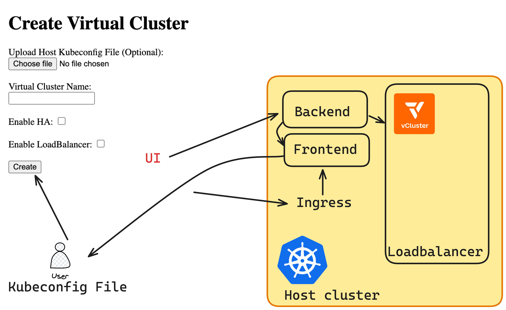

# KubeHatch - Minimalistic Internal Kubernetes Platform


KubeHatch simplifies creating virtual Kubernetes clusters (vClusters) dynamically using a user-friendly web UI, automating deployment and management tasks.

## Overview

This CLI helps you easily create and manage isolated ephemeral Kubernetes clusters (vClusters) for quick and efficient testing, validation, and automation scenarios. You can provide your own kubeconfig or rely on a default kubeconfig of the cluster on which the CLI is running.

## Architecture



## Features

- Create isolated Kubernetes clusters (vClusters).
- Optional High Availability (HA) setup.
- Uses user-provided or default kubeconfig.
- Automated exposure of vClusters via LoadBalancer services.
- Complete self-hosted web UI.

## Try It Out Now

Go to the [Quickstart Guide](https://loftlabs-experiments.github.io/kubehatch/QUICKSTART/) or follow the steps below to get started quickly.

### Quick Start

1. Clone the repo:
   ```bash
   git clone https://github.com/LoftLabs-Experiments/kubehatch.git
   cd kubehatch
   ```
2. Deploy with Kubernetes:
```bash
kubectl apply -f k8s/
```
3. Visit the UI at your ingress URL (see Quickstart for details).

## Documentation
Full documentation is available at [KubeHatch Docs](https://loftlabs-experiments.github.io/kubehatch/).

## Contributing
Contributions welcome! See [Build from Source](https://loftlabs-experiments.github.io/kubehatch/BUILD/) to get started.

