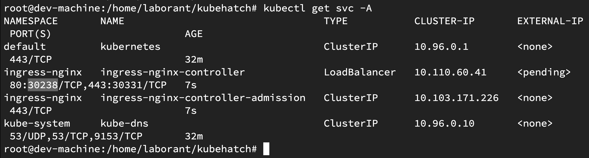
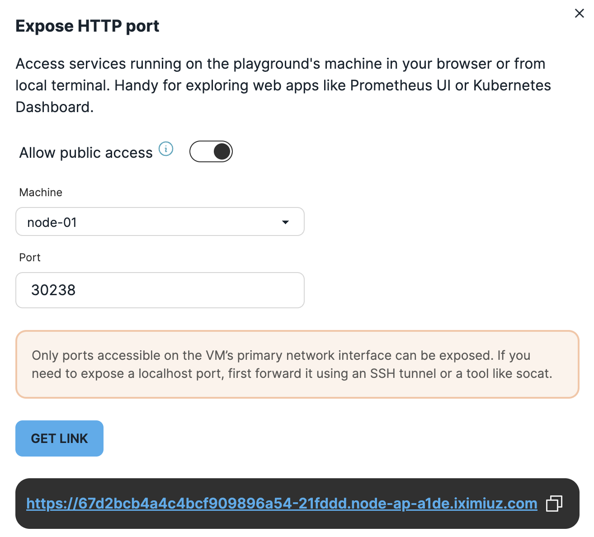

# 🚀 Quickstart Guide: Deploying KubeHatch on Kubernetes

This guide walks you through deploying KubeHatch on a Kubernetes cluster. In this Quickstart we will do it on [IX Playground](https://labs.iximiuz.com/playgrounds)

## 🛠 Prerequisites(if you are not doing on the playground)
Ensure you have the following tools installed before proceeding:
- [kubectl](https://kubernetes.io/docs/tasks/tools/)
- [Helm](https://helm.sh/docs/intro/install/)
- Access to a Kubernetes cluster

---
## Step 1: Clone the repo and Build + Push Docker Image

Ensure you're logged in to your container registry (e.g., Docker Hub).
```
git clone https://github.com/LoftLabs-Experiments/kubehatch.git
cd kubehatch
docker build -t ttl.sh/kubehatch-backend:v1 -f backend/Dockerfile.backend backend/
docker push ttl.sh/kubehatch-backend
docker build -t ttl.sh/kubehatch-frontend:v1 -f frontend/Dockerfile.frontend frontend/
docker push ttl.sh/kubehatch-frontend:latest
```
Replace `ttl.sh` with your registry and image name.

## 🔐 Step 2: Create Kubernetes Secret for Authentication and default Kubeconfig
Before deploying, create a **Kubernetes Secret** to store sensitive credentials.

```sh
echo "admin:$(openssl passwd -apr1 saiyam)" > auth
kubectl create secret generic vcluster-basic-auth --from-file=auth
kubectl create secret generic vcluster-default-kubeconfig --from-file=kubeconfig=/root/.kube/config -n default
```
NOTE - Make sure to replace the path of your kubeconfig file.


## 🚀 Step 3: Deploy the frontend and backend manifests
Replace the backend and frontend deployment with the images you created and then deploy the manifest from the k8s folder.
```
kubectl apply -f k8s/backenddeploy.yaml
kubectl apply -f k8s/deploymentfrontend.yaml
kubectl apply -f k8s/role.yaml
kubectl apply -f k8s/svcfrontend.yaml
kubectl apply -f k8s/backendsvc.yaml
```
##  Step 4:Deploy ingress nginx controller 
```
kubectl apply -f https://raw.githubusercontent.com/kubernetes/ingress-nginx/controller-v1.9.4/deploy/static/provider/cloud/deploy.yaml

```
##  Step 5: Create ingress 
If you are on the playground then you need to first expose the public link on the nodeport of the ingress and then use that as host in your ingress. Sample one from the playground is there in current ingress but it will be different for all. If you are on cluster then point to domain which has the A record of ingress controller LoadBalancer IP.
```
kubectl apply -f k8s/ingress.yaml
```



## Step 6: Open The UI
You need to open up the ingress public URL in the browser and Login.
Currently the username is `admin` and password is `saiyam` and after that you can select checkboxes and wait for a couple of minutes for KubeConfig to Populate.

## Using KubeHatch

Create vCluster with custom kubeconfig

- Open the UI.
- Enter a vCluster name.
- Optional: Select kubeconfig file (if not provided, the default cluster kubeconfig is used).
- Optional: Select if you want to expose your vcluster as LoadBalancer service
- Click Create.
- Wait for vCluster creation to complete. Your generated kubeconfig will appear, and you can download it for use.

#### Create vCluster without custom kubeconfig

Simply provide a name and click Create. The system will automatically use the default kubeconfig from the cluster.

## Cleanup

Delete virtual clusters manually using:

```
vcluster delete <cluster-name> -n vcluster-<cluster-name>
```

##Troubleshooting

Verify RBAC permissions are correctly set.

Check logs:

```
kubectl logs deploy/vcluster-backend
```


Enjoy creating on demand Kubernetes clusters seamlessly with KubeHatch!